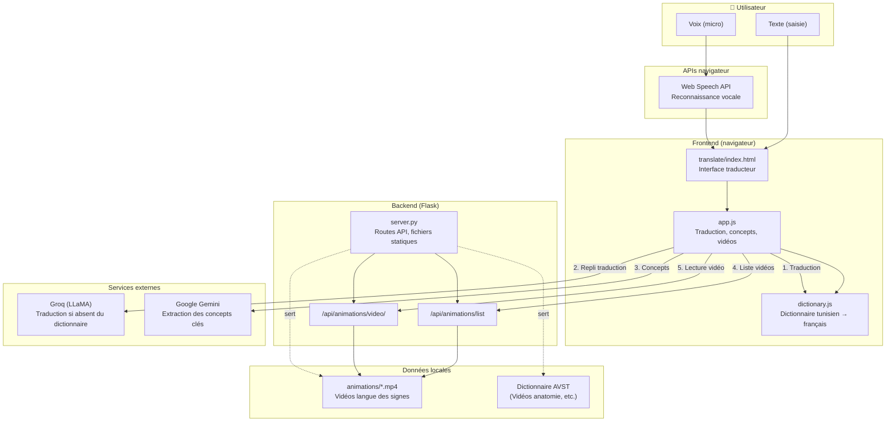

# Voice to Sign

**Traducteur tunisien en langue des signes tunisienne (LST).**

Application web qui permet de saisir ou dicter du texte en **dialecte tunisien**, d’afficher les **vidéos correspondantes en langue des signes** pour les concepts reconnus (dictionnaire médical AVST).

---

## Table des matières

- [Présentation](#présentation)
- [Fonctionnalités](#fonctionnalités)
- [Technologies](#technologies)
- [Architecture globale](#architecture-globale)
- [Structure du projet](#structure-du-projet)
- [Prérequis](#prérequis)
- [Installation](#installation)
- [Lancement](#lancement)
- [Utilisation (étapes)](#utilisation-étapes)
- [Configuration (API)](#configuration-api)
- [Scripts et outils](#scripts-et-outils)
- [Accessibilité](#accessibilité)
- [Licence](#licence)

---

## Présentation

**Voice to Sign** est un outil d’**accessibilité et de médiation linguistique** qui :

1. **Reçoit** du texte ou de la voix en dialecte tunisien.
2. **Traduit** en français (dictionnaire intégré + Groq LLM en secours).
3. **Extrait** les concepts clés de la phrase (Gemini).
4. **Affiche** les vidéos en langue des signes tunisienne pour ces concepts (dictionnaire médical AVST).

L’objectif est de faciliter la communication entre personnes sourdes ou malentendantes et le monde médical / administratif en s’appuyant sur la **langue des signes tunisienne** et un **dictionnaire médical** (anatomie, consultations, équipements, etc.).

---

## Fonctionnalités

- **Saisie texte** : zone de texte pour écrire en tunisien.
- **Reconnaissance vocale** : micro (Web Speech API) pour dicter en tunisien.
- **Extraction de concepts** : identification des mots-clés dans la phrase (Gemini) pour faire correspondre les signes.
- **Vidéos LST** : lecture des vidéos du dictionnaire AVST pour chaque concept reconnu (analyse, attention, médicament, RDV, santé, vaccin, etc.).
- **Contrôles vidéo** : lecture / pause, répétition (non / une fois / boucle), vitesse, luminosité.
- **Grille « Toutes les vidéos »** : accès direct à toutes les animations en un clic.
- **Historique** : liste des dernières traductions.
- **Paramètres d’affichage** : mode (sombre / nuit / clair), contraste, thème de couleurs, taille du texte (interface accessible).

---

## Technologies

| Composant        | Technologie / service                          |
|------------------|-------------------------------------------------|
| Backend          | **Flask** (Python), CORS                        |
| Frontend         | HTML5, CSS3, JavaScript                         |
| Traduction       | Dictionnaire (dictionary.js) + **Groq** (LLaMA)  |
| Concepts / signes | **Google Gemini** (extraction de concepts)       |
| Voix             | **Web Speech API** (reconnaissance vocale)       |
| Vidéos           | Fichiers MP4 (dossier `animations/`)            |
| Optionnel        | Three.js, avatar 3D (squelettes / motion)       |

---

## Architecture globale

Le schéma ci-dessous décrit le flux de données et les composants du système **Voice to Sign**.



### Flux principal (résumé)

| Étape | Composant | Rôle |
|-------|------------|------|
| 1 | **Utilisateur** | Saisit du texte ou parle (micro → Web Speech API). |
| 2 | **dictionary.js** | Cherche la traduction tunisien → français. |
| 3 | **Groq** | Si le terme n’est pas dans le dictionnaire, traduction par LLM. |
| 4 | **Gemini** | Extrait les concepts clés de la phrase française. |
| 5 | **app.js** | Fait correspondre les concepts aux clés de vidéos (PHRASE_TO_VIDEO_KEY, etc.). |
| 6 | **Flask** | Sert la liste des vidéos et le fichier MP4 demandé. |
| 7 | **Frontend** | Joue les vidéos en séquence dans le lecteur (contrôles vitesse, répétition, luminosité). |

### Vue par couches

```
┌─────────────────────────────────────────────────────────────────┐
│  Couche présentation (navigateur)                                │
│  • translate/index.html, styles.css                              │
│  • Lecteur vidéo, contrôles, paramètres d’affichage              │
└─────────────────────────────────────────────────────────────────┘
                                    │
┌─────────────────────────────────────────────────────────────────┐
│  Couche logique (JavaScript)                                     │
│  • app.js : traduction, concepts, matching, lecture vidéo        │
│  • dictionary.js : dictionnaire tunisien → français               │
└─────────────────────────────────────────────────────────────────┘
                                    │
┌─────────────────────────────────────────────────────────────────┐
│  Couche API / services                                           │
│  • Flask (server.py) : /api/animations/list, /api/animations/...   │
│  • Groq (traduction), Gemini (concepts)                          │
│  • Web Speech API (voix)                                          │
└─────────────────────────────────────────────────────────────────┘
                                    │
┌─────────────────────────────────────────────────────────────────┐
│  Données                                                         │
│  • animations/*.mp4  • Dictionnaire AVST  • dictionary.js       │
└─────────────────────────────────────────────────────────────────┘
```

---

## Structure du projet

```
voice-to-sign/
├── README.md                 # Ce fichier
├── index.html                 # Page d’accueil (racine)
├── translate/                 # Application principale « Traducteur »
│   ├── index.html             # Interface traducteur
│   ├── app.js                 # Logique : traduction, concepts, vidéos, paramètres
│   ├── styles.css             # Styles (modes sombre/nuit/clair, thèmes)
│   ├── dictionary.js          # Dictionnaire tunisien → français
│   ├── server.py              # Serveur Flask, routes API
│   └── requirements.txt       # Dépendances Python (translate)
├── animations/                # Vidéos .mp4 (langue des signes)
├── animations_no_bg/         # (Optionnel) Vidéos sans fond (script remove.bg)
├── avatar/                    # Modèles 3D (ex. michel_v3.glb)
├── skeletons/                 # Données squelette (JSON) pour l’avatar
├── DICTIONNAIRE MÉDICAL.../   # Dictionnaire AVST (anatomie, etc.)
└── hand_landmarker.task, sign_model.pth   # Ressources optionnelles
```

---

## Prérequis

- **Python 3.8+**
- **Navigateur moderne** (Chrome, Edge, Firefox) avec support Web Speech API pour le micro
- **ffmpeg** (uniquement si vous utilisez le script `scripts/remove_video_background.py`)

---

## Installation

### 1. Cloner ou télécharger le projet

```bash
git clone <url-du-repo>
cd voice-to-sign
```

### 2. Créer un environnement virtuel (recommandé)

```bash
python -m venv venv
# Windows
venv\Scripts\activate
# Linux / macOS
source venv/bin/activate
```

### 3. Installer les dépendances du serveur

Le serveur Flask et les APIs sont dans `translate/` :

```bash
cd translate
pip install -r requirements.txt
cd ..
```

Dépendances principales : `flask`, `flask-cors`, `numpy`, `torch`, `opencv-python-headless` (pour certaines routes optionnelles).

### 4. Configurer les clés API (voir [Configuration](#configuration-api))

Sans clés, la traduction par Groq et l’extraction de concepts (Gemini) ne fonctionneront pas ; le dictionnaire seul peut encore être utilisé.

---

## Lancement

### Démarrer le serveur Flask

Depuis la **racine** du projet (`voice-to-sign/`) :

```bash
python translate/server.py
```

Le serveur écoute par défaut sur **http://127.0.0.1:5000**.

### Ouvrir l’application

1. **Page d’accueil** : [http://127.0.0.1:5000/](http://127.0.0.1:5000/)
2. **Traducteur (application principale)** : [http://127.0.0.1:5000/translate/](http://127.0.0.1:5000/translate/)

Il est important d’accéder à l’app via cette URL (et non en ouvrant le fichier HTML en local) pour que les appels API (liste des vidéos, traduction, etc.) fonctionnent correctement.

---

## Utilisation (étapes)

1. **Ouvrir** [http://127.0.0.1:5000/translate/](http://127.0.0.1:5000/translate/).
2. **Saisir du texte** en dialecte tunisien dans la zone « Enter Text or Use Mic », ou **cliquer sur le micro** pour dicter.
3. **Cliquer sur « Submit »** pour lancer la traduction.
4. **Consulter** :
   - **« The text that you entered is »** : texte saisi (ou reconnu).
   - **« Key words in sentence »** : concepts extraits.
   - **« Vidéo du signe »** : lecture automatique des vidéos correspondant aux concepts (séquence).
5. **Contrôles vidéo** (sous la vidéo) : Play/Pause, Répéter (Non / Une fois / Boucle), Vitesse, Luminosité.
6. **« Toutes les vidéos (animations) »** : cliquer sur un bouton pour lire une vidéo précise.
7. **Paramètres** (icône engrenage) : mode d’affichage, contraste, thème, taille du texte.

---

## Configuration (API)

Les clés sont utilisées côté frontend (traduction, concepts) ou dans les scripts. Ne commitez pas de clés réelles dans un dépôt public.

| Service   | Rôle                     | Fichier / variable              |
|-----------|---------------------------|----------------------------------|
| **Groq**  | Traduction (repli si absent du dictionnaire) | `translate/app.js` → `GROQ_API_KEY` |
| **Gemini**| Extraction des concepts   | `translate/app.js` → `GEMINI_API_KEY` |

- **Groq** : [console.groq.com](https://console.groq.com) — modèle utilisé : LLaMA (ex. `llama-3.3-70b-versatile`).
- **Gemini** : [Google AI Studio](https://aistudio.google.com) — modèle utilisé : `gemini-1.5-flash`.

---

## Accessibilité

- **Contraste** : réglage du contraste de la page (paramètres).
- **Modes d’affichage** : Mode sombre, Mode nuit, Mode clair.
- **Thèmes** : couleurs (défaut, bleu, violet, orange, vert).
- **Taille du texte** : normale, grande, très grande.
- **Focus visible** : bordures et états de focus pour la navigation clavier.
- **Boutons** : taille minimale ~44 px pour le tactile.
- **Lecteur vidéo** : contrôles accessibles (labels, aria).

---

## Licence

© 2024 Traducteur Tunisien-Français • Dictionnaire + Groq.  
Projet à usage éducatif et d’accessibilité. Les vidéos du dictionnaire AVST (langue des signes tunisienne) restent soumises à leurs propres conditions d’utilisation.
